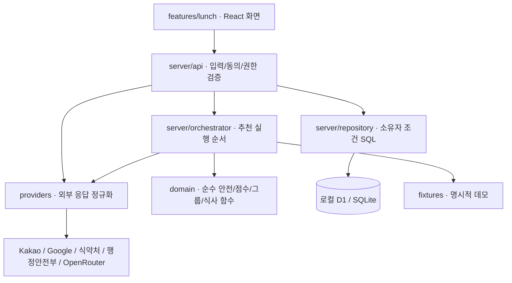
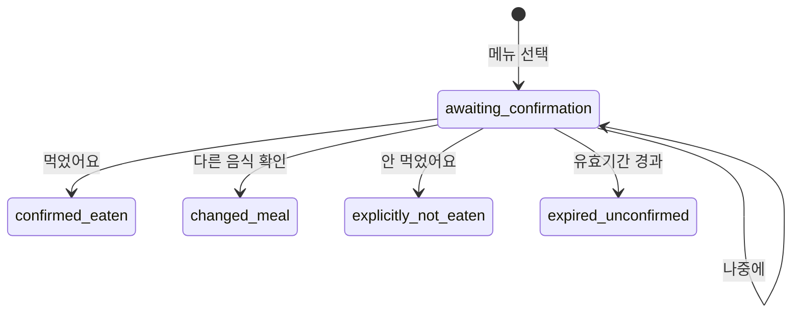

# 아키텍처

## 경계

`domain`은 `server`·`features`를 import하지 않는다. 운영 데이터와 데모 데이터는 `dataMode`로 구분하고 배포 환경의 세션 해시에도 모드를 포함한다.

## 추천 순서

1. Zod 스키마·세션·CSRF·동의 확인.
2. 사용자 입력과 기본값 구분. 요청 날짜 기준 최근 7일의 확인된 식사만 읽기.
3. 실제 조회에 필요한 위치를 먼저 선택. 선택 결과로 중단된 추천을 재개하며 그룹·조건을 유지. 기록 부족 시 어제 식사 질문을 한 번만 제시하고 건너뛰기 허용.
4. 요청 모드와 국가별 provider 선택. 실패를 빈 식당 목록으로 위장하지 않기.
5. safety → 예산/거리/시간/운영 조건 → 기준별 값 → 가중 점수·확인 비중.
6. 그룹은 각자 가능한 메뉴를 고른 뒤 개인별 필수조건을 유지하며 평균·강한 비선호 보정.
7. 메뉴 자료가 있는 후보는 기존 메뉴 순위를 계산한다. 장소만 있는 후보는 `domain/place-ranking.ts`에서 알려진 거리·업종·선호와 제외 조건으로 비교한다. 두 결과를 구분하고 미확인 가격·성분을 채우지 않는다. 화면은 3곳부터 표시하고 나머지를 펼친다.
8. `domain/relaxations.ts`에서 한 조건 변경으로 실제 후보가 늘어나는 경우만 제안한다. 실제 장소 검색은 빈 결과일 때 더 넓은 반경을 한 번만 진단한다. 변경 적용은 서버 발급 제안 ID와 프로필·조건·위치·그룹의 해시를 확인한 뒤 재실행한다. 원래 위치는 DB에 보관하지 않는다.
9. 화면 모드 변경은 기존 결과의 표시만 바꾸기.

## 점수

각 중요도는 0..1로 보관한다. 5점·10점은 표시 척도다.

- 확인 점수 = 관측된 기준의 가중합 / 관측된 기준의 가중치 합.
- 확인 비중 = 관측된 기준 가중치 합 / 전체 활성 가중치 합.
- 비교 하한 = 확인 점수 × 확인 비중.
- 비교 상한 = 하한 + (1 − 확인 비중) × 100.

비교 범위는 누락 정보를 반영한 범위이며 통계적 신뢰구간이나 안전 확률이 아니다. 순위는 적격 후보 우선, 비교 하한·확인 비중을 사용한다. 건강 적합도는 평가식 미검증으로 null이다. 그룹 보호 계수와 취향 점수는 제품 휴리스틱이며 공인 영양 기준이 아니다.

## 식사 상태

만료된 미확인 행은 요청 시 정리되며 식사를 생성하지 않는다. 말단 상태 재요청은 기존 결과를 반환한다. 실제 저장은 별도 식사 보관 동의를 검사한다. 방문 보관에 동의하지 않으면 확인 완료 기록에서 식당·메뉴 링크도 제거한다.

실제 장소의 **여기로 갈게요**는 브라우저 메모리에만 유지되는 방문 계획이다. 메뉴를 임의 생성하지 않으며 별도 섭취 기록 폼에서 사용자가 실제 음식을 입력한 후 기존 기록 API로 저장한다. `providers/persistence.ts`는 새 장소 후보 배열도 제한된 제공자 데이터로 취급해 DB 캐시에서 제거한다.

## 관계형 저장

- sessions: 세션 해시, CSRF, 최소 상태, 만료.
- sensitive_profiles: 별도 동의와 키가 있을 때 암호화 프로필.
- meals: 세션 소유 식사, 날짜, JSON, 소유자+멱등성 키 UNIQUE.
- selections: 확인 대기 및 말단 상태.
- recommendations: 소유자별 임시 추천 결과.
- feedback: 실제 식사 FK, 삭제 시 CASCADE.
- groups / members: 만료 초대, 참여 소유자, 비공개 조건, 암호화 여부.
- consent_events: 동의 항목·정책 버전·시각.

모든 사용자 레코드 접근은 소유자 조건을 포함한다. 그룹 구성 변경·설정 변경·철회 시 참여자의 임시 추천과 대기 선택을 무효화한다. 기록 변경·삭제·보관 만료 후 학습은 남아 있는 확인된 기록에서 재계산한다.

## 런타임 AI

현재 오케스트레이터는 결정적인 TypeScript 코드다. `prompts/`는 원문 보존 자료이고 `server/agent/tool-catalog.ts`는 구현된 기능 계약을 정리한 메타데이터다. 추천 순서와 안전 판정은 계속 코드가 담당한다. `providers/ai.ts`는 별도 동의를 받은 성인의 현재 식사 문장만 OpenRouter 무료 모델로 구분하며 모델 도구 실행은 하지 않는다. 안전·권한·수치 검증은 서버에 남긴다.

식약처 검색·정규화, 공공데이터 envelope, g 중량 환산, 음식점 행정 매칭을 별도 모듈로 나눴다. 음식 검색 결과의 공개 기준값만 제한된 메모리 캐시에 보관하며, 식사 저장은 ID·이름 검증과 별도 보관 동의를 요구한다. 음식점 행정정보는 요청한 행에서만 조회해 모든 식당에 불필요한 호출을 만들지 않는다.
